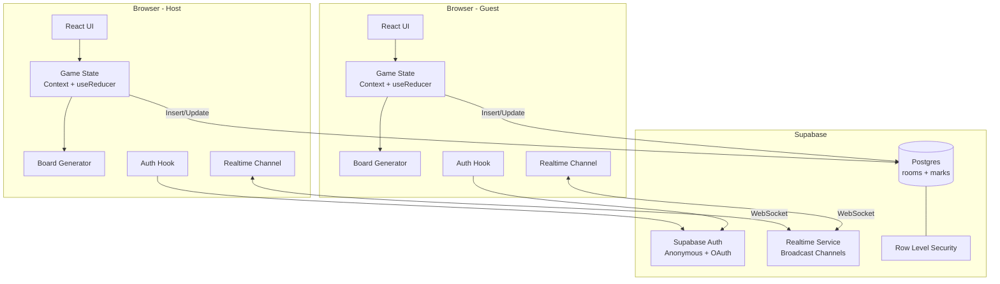
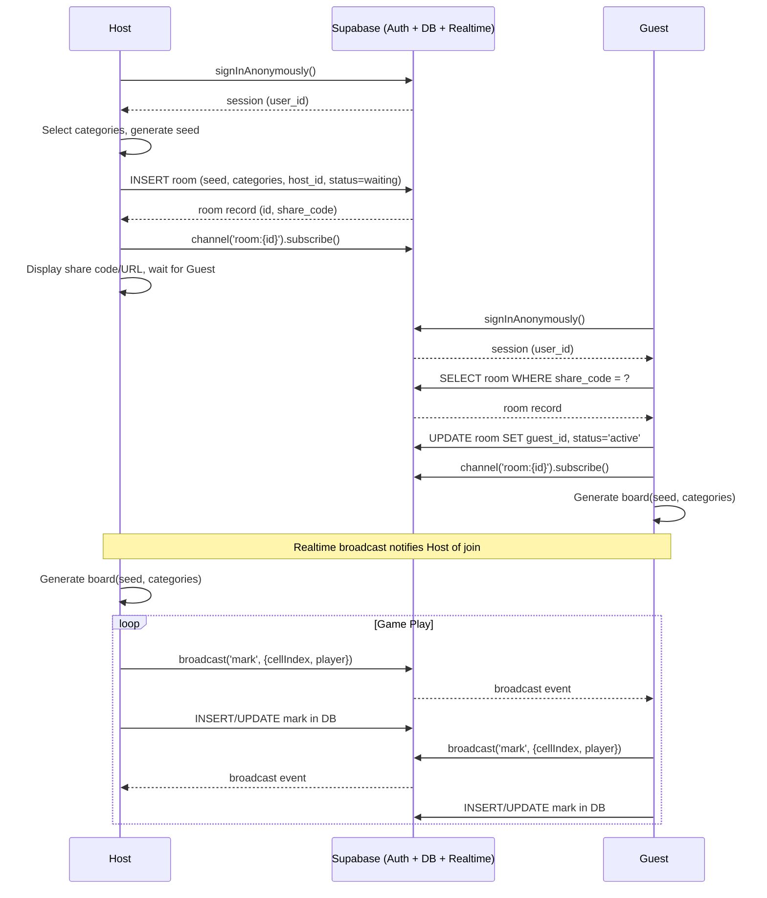
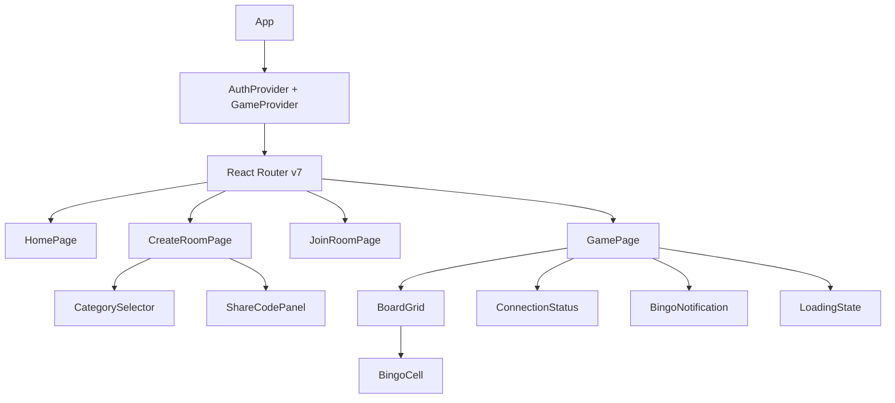
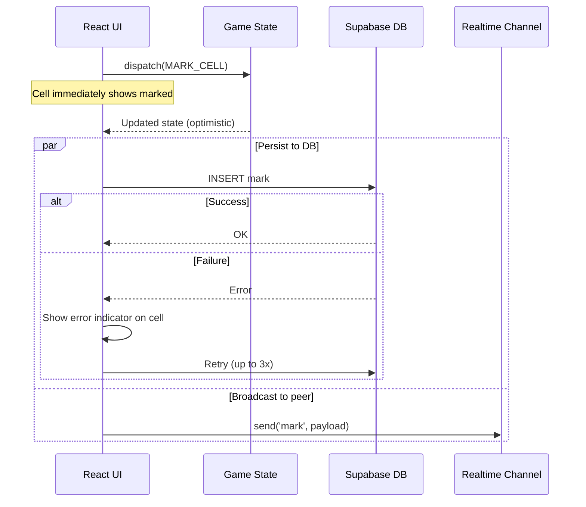
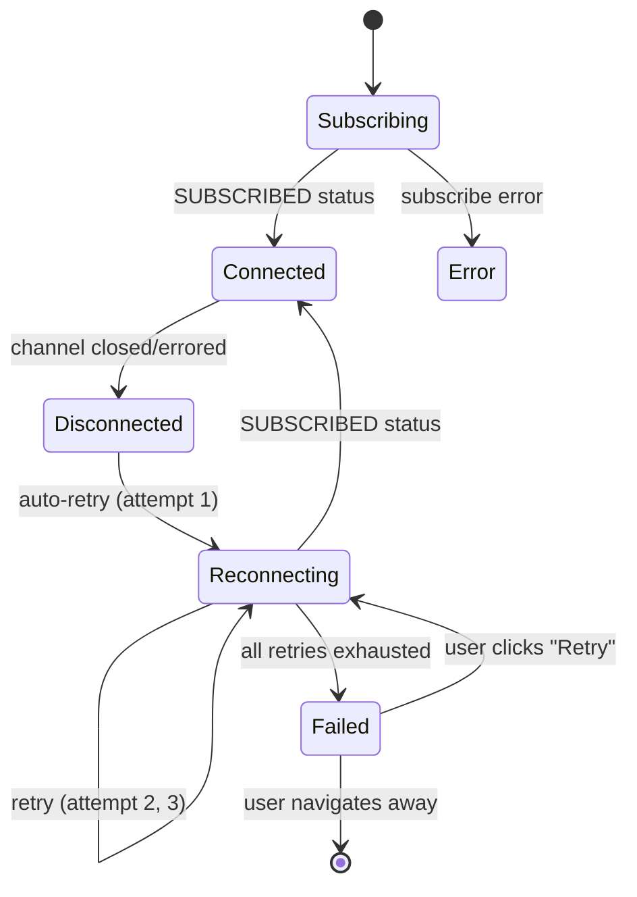

# Design Document

## Overview

This design covers the migration of Rocket League Bingo from a PeerJS/WebRTC + localStorage architecture to a Supabase-backed architecture. The frontend remains a Vite + React 19 + TypeScript static SPA deployed to GitHub Pages. All persistence, authentication, and real-time synchronization move to Supabase (Postgres with RLS, Anonymous Auth, and Realtime Broadcast).

The core gameplay is unchanged: a Host creates a room, selects categories, a Guest joins via share code/URL, both see an identical 5×5 board generated deterministically from a seed, and players mark cells in real time. What changes is the infrastructure underneath:

- **PeerJS** → **Supabase Realtime Broadcast** (WebSocket channels, no peer-to-peer)
- **localStorage persistence** → **Supabase Postgres** (rooms and marks tables with RLS)
- **No identity** → **Supabase Anonymous Auth** (every player gets a persistent user ID)
- **Connection manager** → **Supabase channel subscriptions** (managed reconnection)

Pure logic modules (`board-generator.ts`, `bingo-detector.ts`, `share-code.ts`) remain largely unchanged — they have no network dependencies.

## Architecture

### High-Level Architecture



### Architecture Decisions

| Decision | Choice | Rationale |
|----------|--------|-----------|
| Backend | Supabase (Postgres, Auth, Realtime) | Managed backend, no custom server, generous free tier |
| Auth | Supabase Anonymous Auth | Zero-friction identity; players get a user ID without sign-up |
| Realtime | Supabase Broadcast (not Postgres Changes) | Lower latency, no DB round-trip for subscriber, works with optimistic UI |
| Persistence | Postgres with RLS | Durable game state, survives page reloads and device switches |
| Client library | `@supabase/supabase-js` (browser only) | No SSR, no `@supabase/ssr` needed |
| State management | React Context + useReducer | Same as current — simple enough for this app |
| Board generation | `seedrandom` (Alea) — unchanged | Pure, deterministic, platform-independent |
| Share code | Derived from Room UUID (not peer ID) | Room ID is the stable identifier now, not a PeerJS peer ID |
| Routing | React Router v7 (hash-based) | GitHub Pages compatible, no server rewrites |
| Type safety | Generated types via `supabase gen types typescript` | Compile-time DB schema safety |

### Application Flow



## Components and Interfaces

### React Component Tree



### Routing

```typescript
// src/app/router.tsx
import { createHashRouter } from 'react-router-dom';

const router = createHashRouter([
  { path: '/', element: <HomePage /> },
  { path: '/create', element: <CreateRoomPage /> },
  { path: '/join/:code?', element: <JoinRoomPage /> },
  { path: '/game/:roomId', element: <GamePage /> },
]);
```

URLs: `https://username.github.io/rocket-league-bingo/#/join/ABC123`

### Feature Directory Structure

```
src/
  features/
    auth/
      hooks/useAuth.ts           # Auth state, sign-in, link OAuth
      components/AuthGuard.tsx   # Ensures user is authenticated
    rooms/
      hooks/useRoom.ts           # Room creation, joining, status
      hooks/useRoomChannel.ts    # Realtime channel subscription
      actions.ts                 # createRoom, joinRoom, endGame
      queries.ts                 # getRoomByShareCode, getRoomById
      schemas.ts                 # Zod schemas for room validation
      types.ts                   # Room-specific types
    game/
      hooks/useGameState.ts      # Game state reducer + DB sync
      hooks/useMarks.ts          # Mark/unmark with optimistic updates
      hooks/useBingo.ts          # Bingo detection from marks
      actions.ts                 # markCell, unmarkCell, syncMarks
      queries.ts                 # getMarksForRoom
      types.ts                   # Game-specific types
    categories/
      data/categories.ts         # Static category definitions
      components/CategorySelector.tsx
      types.ts
  lib/
    supabase/
      client.ts                  # Supabase browser client singleton
      types.ts                   # Re-exports from generated types
    board-generator.ts           # Pure deterministic board generation (unchanged)
    bingo-detector.ts            # Pure bingo detection logic (unchanged)
    share-code.ts                # Share code encode/decode (adapted for Room UUID)
```

### Key Module Interfaces

#### 1. `src/lib/supabase/client.ts` — Supabase Client Singleton

```typescript
import { createClient } from '@supabase/supabase-js';
import type { Database } from '@/database.types';

export const supabase = createClient<Database>(
  import.meta.env.VITE_SUPABASE_URL,
  import.meta.env.VITE_SUPABASE_ANON_KEY
);
```

#### 2. `src/lib/board-generator.ts` — Pure Board Generation (unchanged)

```typescript
import seedrandom from 'seedrandom';

interface BoardGeneratorInput {
  seed: string;
  categoryIds: string[];
}

interface Board {
  cells: Cell[];  // 25 cells, row-major order
  seed: string;
  categoryIds: string[];
}

export function generateBoard(input: BoardGeneratorInput): Board;
```

Algorithm remains identical: collect pool → seed Alea PRNG → Fisher-Yates shuffle → take first 25.

#### 3. `src/lib/bingo-detector.ts` — Pure Bingo Detection (unchanged)

```typescript
import type { CellMarks, BingoLine } from '@/types';

export function detectBingo(marks: CellMarks[]): BingoLine[];
```

Checks all 12 lines (5 rows, 5 columns, 2 diagonals). A cell counts as marked if either player has marked it.

#### 4. `src/lib/share-code.ts` — Share Code (adapted)

```typescript
/**
 * In the Supabase version, the share code is derived from the Room UUID,
 * not from a PeerJS peer ID. The Room record stores seed and categories,
 * so the share code only needs to identify the Room.
 */

export function encodeShareCode(roomId: string): string;
export function decodeShareCode(code: string): string | null; // Returns roomId
export function buildShareUrl(code: string): string;
export function parseShareUrl(url: string): string | null; // Returns share code
```

The share code is a compact encoding of the Room UUID (≤8 characters). Since the Room record in the database stores the seed and category selection, the share code no longer needs to encode those values.

**Encoding strategy**: Convert UUID (128 bits) to base62, take first 8 characters. The database has a unique index on `share_code` so collisions are detected at insert time. If a collision occurs (astronomically unlikely with 8 base62 chars = ~47 bits of entropy), regenerate.

#### 5. `src/features/game/hooks/useGameState.ts` — Game State Manager

```typescript
interface GameStateHook {
  state: GameState;
  markCell: (cellIndex: number) => Promise<void>;
  unmarkCell: (cellIndex: number) => Promise<void>;
  isLoading: boolean;
  error: string | null;
}

export function useGameState(roomId: string): GameStateHook;
```

This hook:
1. Loads initial state from DB (room record + marks)
2. Subscribes to Realtime Broadcast channel
3. Applies optimistic updates on local actions
4. Persists marks to DB in background
5. Handles incoming broadcast messages from remote player
6. Retries failed writes (3 attempts, exponential backoff)

#### 6. `src/features/rooms/actions.ts` — Room Actions

```typescript
interface CreateRoomParams {
  seed: string;
  categoryIds: string[];
  hostId: string;
}

interface CreateRoomResult {
  roomId: string;
  shareCode: string;
}

export async function createRoom(params: CreateRoomParams): Promise<CreateRoomResult>;
export async function joinRoom(shareCode: string, guestId: string): Promise<Room>;
export async function endGame(roomId: string): Promise<void>;
```

#### 7. `src/features/rooms/hooks/useRoomChannel.ts` — Realtime Channel

```typescript
interface RoomChannelHook {
  isConnected: boolean;
  connectionState: 'connecting' | 'connected' | 'disconnected' | 'error';
  send: (event: string, payload: BroadcastPayload) => void;
  pendingQueue: BroadcastPayload[];
}

export function useRoomChannel(
  roomId: string,
  onMessage: (event: string, payload: BroadcastPayload) => void
): RoomChannelHook;
```

## Data Models

### Database Schema

#### `rooms` Table

```sql
create type room_status as enum ('waiting', 'active', 'completed', 'expired');

create table public.rooms (
  id uuid primary key default gen_random_uuid(),
  created_at timestamptz not null default now(),
  updated_at timestamptz not null default now(),
  host_id uuid not null references auth.users(id),
  guest_id uuid references auth.users(id),
  seed text not null,
  category_ids text[] not null,
  share_code text not null,
  status room_status not null default 'waiting',
  
  constraint rooms_share_code_unique unique (share_code),
  constraint rooms_seed_not_empty check (length(seed) > 0),
  constraint rooms_category_ids_not_empty check (array_length(category_ids, 1) >= 1)
);

-- Index for share code lookups
create index rooms_share_code_idx on public.rooms (share_code);

-- Index for finding active rooms by player
create index rooms_host_id_idx on public.rooms (host_id) where status in ('waiting', 'active');
create index rooms_guest_id_idx on public.rooms (guest_id) where status = 'active';
```

#### `marks` Table

```sql
create table public.marks (
  id uuid primary key default gen_random_uuid(),
  room_id uuid not null references public.rooms(id) on delete cascade,
  cell_index smallint not null,
  player_id uuid not null references auth.users(id),
  created_at timestamptz not null default now(),
  
  constraint marks_cell_index_range check (cell_index >= 0 and cell_index < 25),
  constraint marks_unique_per_player unique (room_id, cell_index, player_id)
);

-- Index for loading all marks for a room
create index marks_room_id_idx on public.marks (room_id);
```

**Design note**: Marks use INSERT/DELETE rather than a boolean toggle. A mark exists as a row; unmarking deletes the row. This simplifies RLS (player can only delete their own marks) and avoids "who owns this mark" ambiguity.

### RLS Policies

#### `rooms` Table Policies

```sql
alter table public.rooms enable row level security;

-- Anyone authenticated can read a room by share_code (limited fields for "waiting" rooms)
-- Full read access for host and guest of the room
create policy "Participants can read their room"
  on public.rooms for select
  using (
    auth.uid() = host_id 
    or auth.uid() = guest_id
    or (status = 'waiting' and share_code is not null)
  );

-- Only authenticated users can create rooms (they become the host)
create policy "Authenticated users can create rooms"
  on public.rooms for insert
  with check (auth.uid() = host_id);

-- Guest can claim a waiting room; Host can update status to completed
create policy "Guest can join waiting room"
  on public.rooms for update
  using (
    -- Host can update their own room
    (auth.uid() = host_id)
    or 
    -- Any authenticated user can claim a waiting room with no guest
    (status = 'waiting' and guest_id is null)
  )
  with check (
    -- Host updates: can set status to completed
    (auth.uid() = host_id)
    or
    -- Guest join: sets themselves as guest and status to active
    (auth.uid() = guest_id and status = 'active')
  );
```

#### `marks` Table Policies

```sql
alter table public.marks enable row level security;

-- Players can read marks for rooms they participate in
create policy "Participants can read marks"
  on public.marks for select
  using (
    exists (
      select 1 from public.rooms
      where rooms.id = marks.room_id
      and (rooms.host_id = auth.uid() or rooms.guest_id = auth.uid())
    )
  );

-- Players can only insert marks attributed to themselves in active rooms
create policy "Players can insert own marks"
  on public.marks for insert
  with check (
    auth.uid() = player_id
    and exists (
      select 1 from public.rooms
      where rooms.id = marks.room_id
      and rooms.status = 'active'
      and (rooms.host_id = auth.uid() or rooms.guest_id = auth.uid())
    )
  );

-- Players can only delete their own marks in active rooms
create policy "Players can delete own marks"
  on public.marks for delete
  using (
    auth.uid() = player_id
    and exists (
      select 1 from public.rooms
      where rooms.id = marks.room_id
      and rooms.status = 'active'
      and (rooms.host_id = auth.uid() or rooms.guest_id = auth.uid())
    )
  );
```

### Supabase Realtime Channel Design

Each room gets a dedicated Broadcast channel: `room:{roomId}`

```typescript
// Channel setup
const channel = supabase.channel(`room:${roomId}`);

// Events
channel
  .on('broadcast', { event: 'mark' }, ({ payload }) => {
    // payload: { cellIndex: number, playerId: string }
    handleRemoteMark(payload);
  })
  .on('broadcast', { event: 'unmark' }, ({ payload }) => {
    // payload: { cellIndex: number, playerId: string }
    handleRemoteUnmark(payload);
  })
  .on('broadcast', { event: 'player-joined' }, ({ payload }) => {
    // payload: { playerId: string }
    handlePlayerJoined(payload);
  })
  .on('broadcast', { event: 'room-ended' }, () => {
    handleRoomEnded();
  })
  .subscribe((status) => {
    if (status === 'SUBSCRIBED') {
      setConnected(true);
    }
  });

// Sending actions
channel.send({
  type: 'broadcast',
  event: 'mark',
  payload: { cellIndex: 5, playerId: userId },
});
```

**Broadcast Events:**

| Event | Payload | Triggered By |
|-------|---------|-------------|
| `mark` | `{ cellIndex: number, playerId: string }` | Player marks a cell |
| `unmark` | `{ cellIndex: number, playerId: string }` | Player unmarks a cell |
| `player-joined` | `{ playerId: string }` | Guest joins the room |
| `room-ended` | `{}` | Host ends the game |

**Reconnection behavior**: Supabase client handles WebSocket reconnection automatically. The `useRoomChannel` hook monitors channel status and queues messages during disconnection.

### TypeScript Types

```typescript
// src/features/rooms/types.ts
import type { Database } from '@/database.types';

export type Room = Database['public']['Tables']['rooms']['Row'];
export type InsertRoom = Database['public']['Tables']['rooms']['Insert'];
export type UpdateRoom = Database['public']['Tables']['rooms']['Update'];
export type RoomStatus = Database['public']['Enums']['room_status'];

// src/features/game/types.ts
import type { Database } from '@/database.types';

export type Mark = Database['public']['Tables']['marks']['Row'];
export type InsertMark = Database['public']['Tables']['marks']['Insert'];

// Broadcast message types
export interface MarkBroadcast {
  cellIndex: number;
  playerId: string;
}

export interface PlayerJoinedBroadcast {
  playerId: string;
}

// Game state (same core types as before, adapted)
export type PlayerRole = 'host' | 'guest';

export interface CellMarks {
  hostMarked: boolean;
  guestMarked: boolean;
}

export interface GameState {
  board: Board | null;
  marks: CellMarks[];       // 25 entries, derived from DB marks
  myRole: PlayerRole;
  connected: boolean;
  bingoLines: BingoLine[];
  roomId: string;
  seed: string;
  categoryIds: string[];
  isLoading: boolean;
  error: string | null;
}

export type GameAction =
  | { type: 'MARK_CELL'; cellIndex: number; player: PlayerRole }
  | { type: 'UNMARK_CELL'; cellIndex: number; player: PlayerRole }
  | { type: 'SET_BOARD'; board: Board }
  | { type: 'LOAD_MARKS'; marks: CellMarks[] }
  | { type: 'SET_CONNECTED'; connected: boolean }
  | { type: 'SET_LOADING'; isLoading: boolean }
  | { type: 'SET_ERROR'; error: string | null }
  | { type: 'RESET' };
```

### Deriving CellMarks from Database Rows

The `marks` table stores individual mark rows. The client derives the 25-element `CellMarks[]` array:

```typescript
function deriveMarks(dbMarks: Mark[], hostId: string, guestId: string): CellMarks[] {
  const result: CellMarks[] = Array.from({ length: 25 }, () => ({
    hostMarked: false,
    guestMarked: false,
  }));

  for (const mark of dbMarks) {
    const cell = result[mark.cell_index];
    if (!cell) continue;
    if (mark.player_id === hostId) {
      cell.hostMarked = true;
    } else if (mark.player_id === guestId) {
      cell.guestMarked = true;
    }
  }

  return result;
}
```


## Correctness Properties

*A property is a characteristic or behavior that should hold true across all valid executions of a system — essentially, a formal statement about what the system should do. Properties serve as the bridge between human-readable specifications and machine-verifiable correctness guarantees.*

### Property 1: Share code round-trip

*For any* valid Room UUID, encoding it into a share code and then decoding should return the original UUID, and the share code should be no longer than 8 alphanumeric characters. Additionally, for any valid share code, `buildShareUrl` followed by `parseShareUrl` should return the original share code.

**Validates: Requirements 2.3, 3.1**

### Property 2: Board generation determinism and size

*For any* valid seed string and category selection (with ≥25 total items in selected categories), calling `generateBoard` twice with the same inputs should produce an identical 5×5 board of exactly 25 cells.

**Validates: Requirements 5.1, 5.2, 5.4, 5.5**

### Property 3: Board items are drawn from selected categories only

*For any* valid seed and category selection (with ≥25 total items), every cell on the generated board should contain a text value that belongs to one of the selected categories, and no two cells should share the same text value.

**Validates: Requirements 5.1, 5.4**

### Property 4: Mark/unmark preserves other player's marks

*For any* board mark state (25-element CellMarks array), any cell index (0-24), and any player role, marking a cell by one player should not change the other player's mark on that cell, and unmarking by one player should remove only that player's mark while preserving the other player's mark.

**Validates: Requirements 6.1, 6.5**

### Property 5: Mark and unmark actions are idempotent

*For any* board mark state, applying a mark action to a cell already marked by that player should produce the same state (no-op), and applying an unmark action to a cell already unmarked by that player should produce the same state (no-op).

**Validates: Requirements 8.5**

### Property 6: Bingo detection correctness

*For any* 25-element CellMarks array, `detectBingo` reports a line as complete if and only if all 5 cells in that line are marked by at least one player (hostMarked OR guestMarked is true). The function checks all 12 possible lines (5 rows, 5 columns, 2 diagonals).

**Validates: Requirements 7.1, 7.3**

### Property 7: Unmarking can only reduce bingo lines

*For any* board mark state with at least one detected bingo line, if a cell in a complete line is unmarked such that it becomes completely unmarked (neither player has it marked), then the number of detected bingo lines should be less than or equal to the number before the unmark. Specifically, that line should no longer be detected.

**Validates: Requirements 7.5, 7.6**

### Property 8: Category selection count validation

*For any* subset of predefined categories, the computed total of selected items should equal the sum of item counts for each selected category, and the "confirm" action should be enabled if and only if that total is at least 25.

**Validates: Requirements 4.3, 4.4, 4.5**

### Property 9: Category data integrity

*For any* predefined category in the application data: (a) there are at least 3 categories total, (b) each category has a unique identifier and a name of at most 30 characters, (c) each category contains at least 10 items with text between 1-40 characters, (d) items are unique within their category, (e) no two items across all categories share the same text, and (f) the total item count across all categories is at least 25.

**Validates: Requirements 11.1, 11.2, 11.3, 11.5, 11.6**

### Property 10: Share code input validation

*For any* string that is empty, exceeds 8 characters, or contains non-alphanumeric characters, the share code validation should reject it without making a database request.

**Validates: Requirements 3.8**

## Error Handling

### Network and Database Errors

| Scenario | Detection | User Feedback | Recovery |
|----------|-----------|---------------|----------|
| Auth service unreachable | `signInAnonymously()` rejects or 10s timeout | "Unable to connect. Check your internet." | Retry button re-attempts sign-in |
| Room insert fails | `.error` on Supabase insert response | "Room creation failed. Please try again." | Retry button on same screen |
| Room lookup fails (network) | `.error` on Supabase select response | "Connection error. Please try again." | Retry with pre-filled share code |
| Room not found (invalid code) | Empty result from select | "Invalid code. Please check and try again." | Clear input, allow re-entry |
| Room unavailable (wrong status) | Room found but status ≠ 'waiting' | "This room is no longer available." | Offer create new room or try different code |
| Mark persist fails | `.error` on insert/delete response | Error indicator on affected cell | Retry up to 3 times (1s, 2s, 4s backoff) |
| Mark persist fails after retries | All 3 retries exhausted | Persistent error indicator on cell | Keep optimistic local state; offer manual retry |
| Realtime channel disconnects | Channel status changes to 'closed'/'errored' | Connection-lost banner | Auto-retry 3 times (1s, 2s, 4s backoff) |
| All channel retries exhausted | 3 retries all fail | "Connection lost. Your progress is saved." | Manual retry button |
| OAuth identity linking fails | `linkIdentity()` returns error | "Account linking failed." | Continue as anonymous, offer retry |
| DB read fails on page reload | `.error` on select for room/marks | "Could not load game state." | Retry button |

### Optimistic Update Strategy



### Retry Configuration

```typescript
const RETRY_CONFIG = {
  maxAttempts: 3,
  baseDelay: 1000, // 1 second
  backoffMultiplier: 2, // 1s, 2s, 4s
};

async function withRetry<T>(
  operation: () => Promise<T>,
  config = RETRY_CONFIG
): Promise<T> {
  let lastError: Error;
  for (let attempt = 0; attempt < config.maxAttempts; attempt++) {
    try {
      return await operation();
    } catch (error) {
      lastError = error as Error;
      if (attempt < config.maxAttempts - 1) {
        await delay(config.baseDelay * Math.pow(config.backoffMultiplier, attempt));
      }
    }
  }
  throw lastError!;
}
```

### Reconnection State Machine



During disconnection:
- Local marks continue to work (optimistic state)
- Actions are queued in memory
- On reconnection: queued actions are broadcast and persisted
- If state diverges: DB marks are fetched and reconciled

## Testing Strategy

### Testing Approach

This project uses a multi-layered testing strategy:

1. **Property-based tests** — Verify universal correctness properties across randomized inputs using `@fast-check/vitest`
2. **Unit tests** — Verify specific examples, edge cases, and integration points using Vitest
3. **Component tests** — Verify React component behavior using React Testing Library
4. **Integration tests** — Verify Supabase interactions with mocked client or local Supabase instance

### Property-Based Testing

**Library**: `@fast-check/vitest`
**Runner**: Vitest
**Minimum iterations**: 100 per property

**Import and syntax:**

```typescript
import { test, fc } from '@fast-check/vitest';
```

**Custom generators for domain types:**

```typescript
// Valid seed: 22-char base62 string (128-bit value encoded)
const base62Chars = '0123456789ABCDEFGHIJKLMNOPQRSTUVWXYZabcdefghijklmnopqrstuvwxyz';
const seedArbitrary = fc.stringOf(
  fc.constantFrom(...base62Chars.split('')),
  { minLength: 22, maxLength: 22 }
);

// Category selection: subset of real category IDs with enough items
const categorySelectionArbitrary = fc.subarray(allCategoryIds, { minLength: 1 })
  .filter(ids => totalItems(ids) >= 25);

// Cell marks: exactly 25 entries
const marksArbitrary = fc.array(
  fc.record({ hostMarked: fc.boolean(), guestMarked: fc.boolean() }),
  { minLength: 25, maxLength: 25 }
);

// Player role
const playerRoleArbitrary = fc.constantFrom('host', 'guest') as fc.Arbitrary<PlayerRole>;

// Cell index
const cellIndexArbitrary = fc.nat({ max: 24 });

// Room UUID
const uuidArbitrary = fc.uuid();
```

**Properties to implement:**

| Property | Module Under Test | Test File |
|----------|-------------------|-----------|
| 1: Share code round-trip | `src/lib/share-code.ts` | `share-code.prop.test.ts` |
| 2: Board determinism + size | `src/lib/board-generator.ts` | `board-generator.prop.test.ts` |
| 3: Board items from selected categories | `src/lib/board-generator.ts` | `board-generator.prop.test.ts` |
| 4: Mark/unmark preserves other player | `src/features/game/` (reducer) | `gameStateReducer.prop.test.ts` |
| 5: Idempotent actions | `src/features/game/` (reducer) | `gameStateReducer.prop.test.ts` |
| 6: Bingo detection correctness | `src/lib/bingo-detector.ts` | `bingo-detector.prop.test.ts` |
| 7: Unmark reduces bingo lines | `src/lib/bingo-detector.ts` | `bingo-detector.prop.test.ts` |
| 8: Category count validation | `src/features/categories/` | `categories.prop.test.ts` |
| 9: Category data integrity | `src/features/categories/data/` | `categories.prop.test.ts` |
| 10: Share code input validation | `src/lib/share-code.ts` | `share-code.prop.test.ts` |

Each property test is tagged with a comment:

```typescript
// Feature: rocket-league-bingo-supabase, Property 1: Share code round-trip
test.prop([uuidArbitrary], { numRuns: 100 })(
  'share code encode/decode round-trip preserves room ID',
  (roomId) => {
    const code = encodeShareCode(roomId);
    expect(code.length).toBeLessThanOrEqual(8);
    expect(decodeShareCode(code)).toEqual(roomId);
  }
);
```

### Unit Tests (Example-Based)

Focus on specific scenarios that complement property tests:

- **Auth**: signInAnonymously called on first load, session reused on subsequent loads
- **Room creation**: correct fields in insert, share code displayed
- **Room joining**: atomic update sets guest_id and status, various error states
- **Board generation**: edge case with exactly 25 items (all used)
- **Bingo notification**: appears on detection, disappears when no lines remain
- **Connection status**: renders correct state for each connection phase
- **End game**: status update + broadcast + UI lock

### Component Tests (React Testing Library)

- `HomePage` renders create/join options
- `CategorySelector` toggles categories, shows item count, enables/disables confirm
- `BoardGrid` renders 5×5 grid with correct cell states
- `BingoCell` shows correct visual state for all 4 mark combinations
- `ConnectionStatus` shows connected/disconnected/reconnecting
- `BingoNotification` appears and dismisses correctly
- `ShareCodePanel` displays code and URL, copy button works
- `GamePage` shows loading state while restoring from DB

### Integration Tests (Supabase)

Run against local Supabase instance (`supabase start`):

- RLS: third user cannot read room data
- RLS: guest cannot update room config
- RLS: player cannot insert mark with another player's ID
- RLS: unauthenticated request is rejected
- Room join: atomic guest_id + status update works
- Mark persistence: insert and delete operations succeed for participants
- Room lifecycle: waiting → active → completed transitions

### Test File Naming Convention

```
src/lib/board-generator.ts          → src/lib/board-generator.prop.test.ts
src/lib/bingo-detector.ts           → src/lib/bingo-detector.prop.test.ts
src/lib/share-code.ts               → src/lib/share-code.prop.test.ts
src/features/game/reducer.ts        → src/features/game/reducer.prop.test.ts
src/features/categories/data/...    → src/features/categories/categories.prop.test.ts
```

### Test Configuration

```typescript
// vite.config.ts (test section)
test: {
  environment: 'jsdom',
  globals: true,
  setupFiles: ['./src/test/setup.ts'],
}
```

Property tests run as part of the standard `vitest --run` command. No separate test runner needed.
