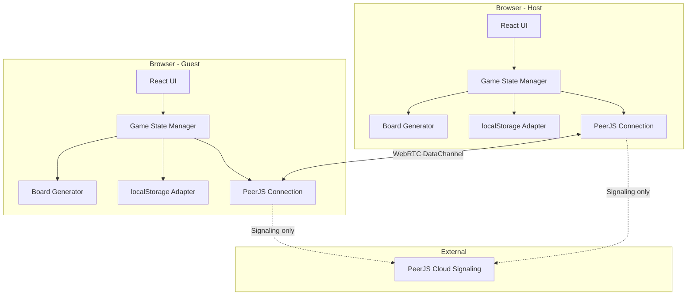
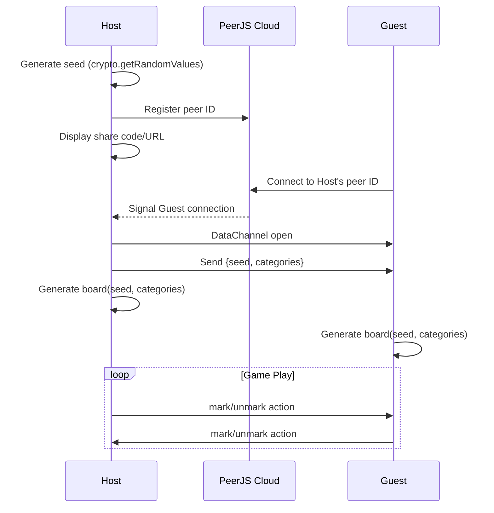
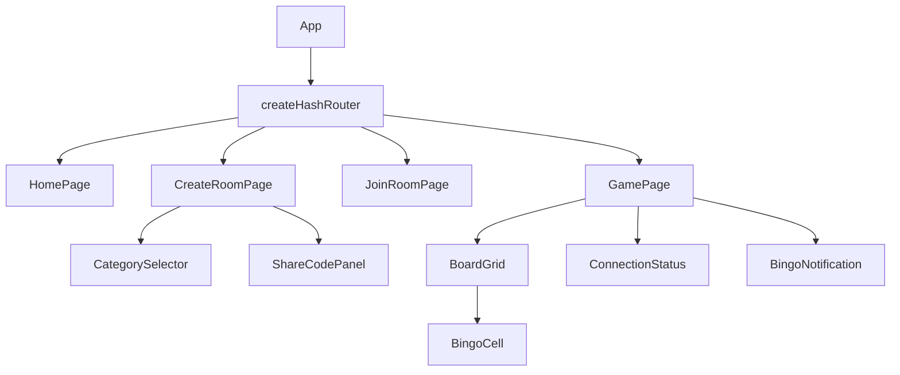
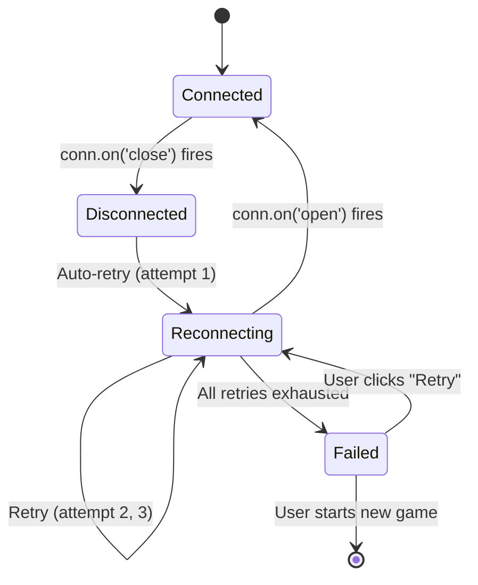

# Design Document

## Overview

Rocket League Bingo is a client-side React single-page application that enables two players to play bingo together in real time using Rocket League game events as bingo categories. The application runs entirely on GitHub Pages with no backend infrastructure — peer-to-peer communication is handled via PeerJS (WebRTC DataChannel), board generation is deterministic via a seeded PRNG, and game state persists in localStorage.

The core flow:
1. Host creates a room → generates a seed + PeerJS peer ID → shares a compact code/URL
2. Guest joins via code/URL → connects to Host via WebRTC DataChannel
3. Both players generate the identical board locally from the shared seed + category selection
4. Players mark cells in real time, with actions synchronized over the DataChannel
5. Bingo detection runs independently on each client from the synchronized board state

## Architecture

### High-Level Architecture



### Architecture Decisions

| Decision | Choice | Rationale |
|----------|--------|-----------|
| Framework | React 18+ with Vite | Fast builds, excellent DX, tree-shaking for small bundle |
| Routing | `createHashRouter` (react-router-dom v6) | GitHub Pages doesn't support server-side rewrites; hash URLs (`/#/path`) never send the hash portion to the server, eliminating the need for 404.html workarounds |
| State Management | React Context + useReducer | Simple enough for two-screen app; no Redux needed |
| Seeded PRNG | `seedrandom` — Alea algorithm via `seedrandom.alea(seed)` | Faster than default ARC4, deterministic across platforms, explicit seeding (no auto-seed), small footprint |
| P2P Library | PeerJS with free cloud signaling server | Abstracts WebRTC complexity; uses default PeerJS cloud signaling (no custom server needed) |
| Styling | CSS Modules or Tailwind CSS | Scoped styles, no runtime cost |
| Build/Deploy | Vite + `gh-pages` package + GitHub Actions | `vite.config.js` sets `base: '/rocket-league-bingo/'`; deploy via `gh-pages -d dist` |
| PBT Library | `@fast-check/vitest` | TypeScript-native, first-class Vitest integration via `test.prop()` syntax |

#### Routing: `createHashRouter` vs `HashRouter`

We use `createHashRouter` (the data router API) rather than the `<HashRouter>` wrapper component. Rationale:
- `createHashRouter` supports the full data router feature set (loaders, actions, error boundaries)
- URLs become `https://username.github.io/rocket-league-bingo/#/join/CODE` — the `#` portion is never sent to the server
- No 404.html redirect workaround needed (unlike `BrowserRouter` on GitHub Pages)
- Future-proof: if we add route loaders for share code parsing, the data router supports it natively

#### Deployment Configuration

```javascript
// vite.config.js
export default defineConfig({
  base: '/rocket-league-bingo/',
  // ...
});
```

```json
// package.json (relevant scripts)
{
  "homepage": "https://username.github.io/rocket-league-bingo",
  "scripts": {
    "build": "vite build",
    "predeploy": "npm run build",
    "deploy": "gh-pages -d dist"
  }
}
```

GitHub Actions can automate deployment on push to `main` — the workflow runs `npm run build` and deploys the `dist/` folder to the `gh-pages` branch.

### Application Flow



## Components and Interfaces

### React Component Tree



#### Router Setup

```typescript
import { createHashRouter, RouterProvider } from 'react-router-dom';

const router = createHashRouter([
  { path: '/', element: <HomePage /> },
  { path: '/create', element: <CreateRoomPage /> },
  { path: '/join/:code?', element: <JoinRoomPage /> },
  { path: '/game', element: <GamePage /> },
]);

function App() {
  return <RouterProvider router={router} />;
}
```

URLs will look like: `https://username.github.io/rocket-league-bingo/#/join/ABC123XYZ`

### Key Modules

#### 1. `boardGenerator` — Pure function module

```typescript
import seedrandom from 'seedrandom';

interface BoardGeneratorInput {
  seed: string;
  categoryIds: string[];
}

interface Board {
  cells: Cell[];  // 25 cells, row-major order
  seed: string;
  categoryIds: string[];
}

interface Cell {
  index: number;        // 0-24, position on board
  text: string;         // Category item display text
  categoryId: string;   // Which category this item belongs to
}

function generateBoard(input: BoardGeneratorInput): Board;
```

**seedrandom API usage:**

```typescript
// Use Alea algorithm (faster, recommended for deterministic board generation)
const rng = seedrandom.alea(seed);

// rng() returns float in [0, 1) — used for Fisher-Yates shuffle
// Same seed ALWAYS produces same sequence:
// seedrandom.alea('hello.')() always returns the same value

// Fisher-Yates shuffle using seeded PRNG:
function shuffle<T>(arr: T[], rng: () => number): T[] {
  const result = [...arr];
  for (let i = result.length - 1; i > 0; i--) {
    const j = Math.floor(rng() * (i + 1));
    [result[i], result[j]] = [result[j], result[i]];
  }
  return result;
}
```

**Key constraint**: Alea requires explicit seeding (no auto-seed fallback). We always pass the seed string directly.

#### 2. `connectionManager` — PeerJS wrapper

```typescript
import Peer, { DataConnection } from 'peerjs';

interface ConnectionManager {
  createRoom(): Promise<{ peerId: string }>;
  joinRoom(peerId: string): Promise<void>;
  send(message: GameMessage): void;
  onMessage(handler: (msg: GameMessage) => void): void;
  onDisconnect(handler: () => void): void;
  onConnect(handler: () => void): void;
  disconnect(): void;
  isConnected(): boolean;
}
```

**PeerJS API usage:**

```typescript
// Host: Create peer with deterministic ID derived from seed
const peer = new Peer(`rlb-${seedBase62}`);

peer.on('open', (id) => {
  // Peer registered with signaling server, ready to accept connections
  console.log('My peer ID is:', id);
});

peer.on('connection', (conn: DataConnection) => {
  // Guest connected to us
  conn.on('open', () => {
    conn.send({ type: 'INIT', payload: { seed, categoryIds } });
  });
  conn.on('data', (data) => {
    // Handle incoming game messages
  });
});

peer.on('error', (error) => {
  // Handle connection errors (peer-unavailable, network, etc.)
  console.error('PeerJS error:', error.type, error.message);
});

// Guest: Connect to host's peer ID
const peer = new Peer(); // Auto-generated ID for guest
const conn = peer.connect(`rlb-${seedBase62}`);

conn.on('open', () => {
  // DataChannel established, can send/receive
  conn.send({ type: 'SYNC_REQUEST' });
});

conn.on('data', (data) => {
  // Handle incoming game messages from host
});

// Cleanup
peer.disconnect(); // Disconnect from signaling server (keeps existing connections)
conn.close();      // Close specific data connection
peer.destroy();    // Close all connections and disconnect
```

**Key design notes:**
- PeerJS uses its free cloud signaling server by default — no custom server configuration needed
- Custom peer IDs (`rlb-{seed_base62}`) allow the Guest to derive the Host's peer ID from the share code alone
- The signaling server is only used for initial WebRTC handshake; all game data flows directly peer-to-peer via DataChannel

#### 3. `shareCodeCodec` — Encode/decode share codes

```typescript
// Share code encodes: peerId + seed + categoryIds
interface ShareCodeData {
  peerId: string;
  seed: string;
  categoryIds: string[];
}

function encodeShareCode(data: ShareCodeData): string;  // ≤32 chars
function decodeShareCode(code: string): ShareCodeData;
function buildShareUrl(code: string): string;
function parseShareUrl(url: string): ShareCodeData | null;
```

#### 4. `gameStateReducer` — State management

```typescript
type GameAction =
  | { type: 'MARK_CELL'; cellIndex: number; player: PlayerRole }
  | { type: 'UNMARK_CELL'; cellIndex: number; player: PlayerRole }
  | { type: 'SET_BOARD'; board: Board }
  | { type: 'SYNC_STATE'; state: GameState }
  | { type: 'RESET' };

function gameStateReducer(state: GameState, action: GameAction): GameState;
```

#### 5. `bingoDetector` — Pure function

```typescript
type BingoLine = { type: 'row' | 'column' | 'diagonal'; index: number };

function detectBingo(marks: CellMarks[]): BingoLine[];
```

#### 6. `persistenceAdapter` — localStorage wrapper

```typescript
interface PersistenceAdapter {
  saveGameState(state: PersistedState): void;
  loadGameState(): PersistedState | null;
  clearGameState(): void;
}
```

### Message Protocol (DataChannel)

```typescript
type GameMessage =
  | { type: 'INIT'; payload: { seed: string; categoryIds: string[] } }
  | { type: 'MARK'; payload: { cellIndex: number; player: PlayerRole } }
  | { type: 'UNMARK'; payload: { cellIndex: number; player: PlayerRole } }
  | { type: 'SYNC_REQUEST' }
  | { type: 'SYNC_RESPONSE'; payload: { marks: CellMarks[] } }
  | { type: 'PING' }
  | { type: 'PONG' };

type PlayerRole = 'host' | 'guest';
```

## Data Models

### Core Types

```typescript
// Player role in the session
type PlayerRole = 'host' | 'guest';

// State of marks on a single cell
interface CellMarks {
  hostMarked: boolean;
  guestMarked: boolean;
}

// Full game state held in memory
interface GameState {
  board: Board | null;
  marks: CellMarks[];          // 25 entries, indexed by cell position
  myRole: PlayerRole;
  connected: boolean;
  bingoLines: BingoLine[];     // Currently active bingo lines
  seed: string;
  categoryIds: string[];
}

// What gets persisted to localStorage
interface PersistedState {
  seed: string;
  categoryIds: string[];
  marks: CellMarks[];
  myRole: PlayerRole;
  peerId: string;              // For reconnection
  remotePeerId: string;        // For reconnection
  timestamp: number;           // For staleness detection
}

// Category definition (bundled static data)
interface Category {
  id: string;
  name: string;
  items: string[];             // Each ≤40 characters
}

// Bingo line descriptor
interface BingoLine {
  type: 'row' | 'column' | 'diagonal';
  index: number;               // 0-4 for rows/cols, 0-1 for diagonals
}
```

### Share Code Encoding

The share code must fit within 32 characters and encode:
- PeerJS peer ID (variable length, typically ~20 chars from PeerJS cloud)
- Seed (128-bit random value)
- Selected category IDs

**Strategy**: Use a custom peer ID derived from the seed to reduce redundancy. The Host creates a PeerJS peer with a deterministic ID: `new Peer('rlb-' + seedBase62)`. This means the share code only needs to encode the seed + category selection bitmask — the Guest can derive the peer ID independently.

```
Share Code Format:
[seed_base62 (22 chars)][category_bitmask_base62 (1-2 chars)]
Total: ≤ 24 chars (well within 32 limit)

PeerID derivation: `rlb-${seed_base62}` (deterministic from seed)
```

This means:
- The seed (128 bits) is encoded as 22 base62 characters
- Category selection is a bitmask encoded as 1-2 base62 characters (supports up to ~62 categories)
- The PeerJS peer ID is derived deterministically: `rlb-{seed_base62}`
- Both Host and Guest can compute the peer ID from the share code alone
- Host creates peer: `new Peer('rlb-' + seedBase62)`
- Guest connects: `peer.connect('rlb-' + seedBase62)`

### Board Generation Algorithm

```typescript
import seedrandom from 'seedrandom';

function generateBoard(seed: string, categoryIds: string[]): Board {
  // 1. Collect all items from selected categories into a pool
  const pool = categoryIds.flatMap(id => 
    getCategory(id).items.map(text => ({ text, categoryId: id }))
  );

  // 2. Initialize seeded PRNG with Alea algorithm (faster, deterministic)
  const rng = seedrandom.alea(seed);

  // 3. Fisher-Yates shuffle the pool using the seeded PRNG
  for (let i = pool.length - 1; i > 0; i--) {
    const j = Math.floor(rng() * (i + 1));  // rng() returns [0, 1)
    [pool[i], pool[j]] = [pool[j], pool[i]];
  }

  // 4. Take the first 25 items from the shuffled pool
  const cells = pool.slice(0, 25).map((item, index) => ({
    index,
    text: item.text,
    categoryId: item.categoryId,
  }));

  // 5. Return as a 5×5 board (row-major order)
  return { cells, seed, categoryIds };
}
```

This guarantees:
- Same seed + same categories = same board (deterministic)
- Platform-independent (`seedrandom.alea` is specified to produce identical sequences across all JS environments)
- No network transmission of board data needed
- Alea algorithm is faster than the default ARC4 and sufficient for non-cryptographic shuffling
- `rng()` always returns a float in `[0, 1)` — same contract as `Math.random()` but deterministic


## Correctness Properties

*A property is a characteristic or behavior that should hold true across all valid executions of a system — essentially, a formal statement about what the system should do. Properties serve as the bridge between human-readable specifications and machine-verifiable correctness guarantees.*

### Property 1: Share code round-trip

*For any* valid seed (128-bit value) and any valid category selection (bitmask), encoding into a share code and then decoding should produce the original seed and category selection, and the share code should be no longer than 32 characters.

**Validates: Requirements 1.2, 2.1**

### Property 2: Board generation determinism and size

*For any* valid seed and category selection (with ≥25 total items in selected categories), calling `generateBoard` multiple times with the same inputs should always produce an identical 5×5 board of exactly 25 cells.

**Validates: Requirements 4.1, 4.2, 4.4, 4.5**

### Property 3: Board items are drawn from selected categories only

*For any* valid seed and category selection, every cell on the generated board should contain an item that belongs to one of the selected categories, and no item should appear more than once on the board.

**Validates: Requirements 4.1, 4.4**

### Property 4: Cell mark/unmark state transitions preserve other player's marks

*For any* board state and any cell index, marking a cell by one player should not affect the other player's mark on that cell, and unmarking should remove only the acting player's mark while preserving the other player's mark.

**Validates: Requirements 5.1, 5.3, 5.5**

### Property 5: Mark and unmark actions are idempotent

*For any* board state, applying a mark action to a cell that is already marked by that player should produce the same state, and applying an unmark action to a cell that is already unmarked by that player should produce the same state.

**Validates: Requirements 7.5**

### Property 6: Bingo detection correctness

*For any* board mark configuration, bingo is detected if and only if there exists at least one complete line (row, column, or diagonal) where all 5 cells are marked by at least one player (union of both players' marks).

**Validates: Requirements 6.1, 6.3**

### Property 7: Unmarking a cell in a bingo line removes that bingo

*For any* board state that has a detected bingo line, if a cell in that line is unmarked such that it becomes completely unmarked (neither player has it marked), then that line should no longer be detected as a bingo.

**Validates: Requirements 6.5**

### Property 8: Game state persistence round-trip

*For any* valid game state (including seed, category selection, marks with player attribution, and connection info), persisting to localStorage and then loading should produce an equivalent game state.

**Validates: Requirements 8.2, 8.5**

### Property 9: Category data integrity

*For any* category in the predefined data, the category should have a unique name, contain at least 10 items, each item should be no longer than 40 characters, and no item should be duplicated within the same category.

**Validates: Requirements 9.2, 9.3**

### Property 10: Category selection item count validation

*For any* combination of selected categories, the total item count displayed should equal the sum of items in each selected category, and the confirm action should be enabled if and only if that total is at least 25.

**Validates: Requirements 3.3, 3.4, 3.6**

## Error Handling

### Connection Errors

| Scenario | Detection | User Feedback | Recovery |
|----------|-----------|---------------|----------|
| PeerJS initialization fails | `peer.on('error', (error) => {...})` — check `error.type` for `'server-error'` or `'socket-error'`; also 10s timeout on `peer.on('open')` | "Could not connect to signaling server. Check your internet connection." | Retry button calls `peer.destroy()` then re-creates `new Peer(peerId)` |
| Guest enters invalid share code | `decodeShareCode` returns null | "Invalid share code. Please check and try again." | Clear input, allow re-entry |
| Host unreachable (15s timeout) | `peer.on('error', (error) => {...})` with `error.type === 'peer-unavailable'`; also 15s timeout on `conn.on('open')` | "Host is unreachable. They may have closed the room." | Return to join screen |
| Room full (second guest) | Host sends rejection message via `conn.send({ type: 'REJECT', reason: 'room-full' })` then `conn.close()` | "This room already has a player." | Return to join screen |
| DataChannel disconnects mid-game | `conn.on('close', () => {...})` event | Connection-lost banner with reconnection countdown | Auto-retry 3 times with exponential backoff |
| Reconnection fails after retries | All 3 retries exhausted (each via `peer.connect(remotePeerId)`) | "Connection lost. Your progress is saved locally." | Option to copy share code and rejoin |

### State Errors

| Scenario | Detection | User Feedback | Recovery |
|----------|-----------|---------------|----------|
| localStorage corrupted | JSON.parse throws or schema validation fails | Silent — show home screen | Clear corrupted data, fresh start |
| localStorage quota exceeded | `setItem` throws QuotaExceededError | Silent — game continues without persistence | Log warning, continue without saves |
| Invalid message received | Message schema validation fails | Silent — ignore message | Log warning, do not apply action |
| Board generation with insufficient items | Item count < 25 after category selection | Confirm button disabled with helper text | User must select more categories |

### Reconnection Strategy



- Retry delays: 1s, 2s, 4s (exponential backoff)
- Each retry: `const conn = peer.connect(remotePeerId)` → wait for `conn.on('open')`
- On successful reconnection: send `SYNC_REQUEST` via `conn.send(...)`, receive `SYNC_RESPONSE`, merge marks
- During disconnection: local marking still works, queued actions sent on reconnect via `conn.send()`
- If peer was disconnected from signaling: call `peer.reconnect()` before attempting `peer.connect()`

## Testing Strategy

### Testing Approach

This project uses a dual testing strategy:

1. **Property-based tests** — Verify universal correctness properties across randomized inputs using `@fast-check/vitest`
2. **Unit tests** — Verify specific examples, edge cases, and integration points using Vitest
3. **Component tests** — Verify React component behavior using React Testing Library

### Property-Based Testing

**Library**: [`@fast-check/vitest`](https://github.com/dubzzz/fast-check/tree/main/packages/vitest) — first-class Vitest integration
**Runner**: Vitest
**Minimum iterations**: 100 per property (configured via `numRuns`)

**Import and syntax:**

```typescript
import { test, fc } from '@fast-check/vitest';
```

**Array parameter syntax** (positional args):

```typescript
// Feature: rocket-league-bingo, Property 1: Share code round-trip
test.prop([fc.string(), fc.array(fc.string())], { numRuns: 100 })(
  'share code round-trip preserves seed and categories',
  (seed, categoryIds) => {
    const encoded = encodeShareCode({ seed, categoryIds });
    expect(encoded.length).toBeLessThanOrEqual(32);
    const decoded = decodeShareCode(encoded);
    expect(decoded.seed).toEqual(seed);
    expect(decoded.categoryIds).toEqual(categoryIds);
  }
);
```

**Named parameter syntax** (destructured object):

```typescript
// Feature: rocket-league-bingo, Property 6: Bingo detection correctness
test.prop({ marks: fc.array(fc.record({ hostMarked: fc.boolean(), guestMarked: fc.boolean() }), { minLength: 25, maxLength: 25 }) })(
  'bingo detected iff complete line exists',
  ({ marks }) => {
    const lines = detectBingo(marks);
    // Verify each detected line is actually complete
    for (const line of lines) {
      const indices = getLineIndices(line);
      expect(indices.every(i => marks[i].hostMarked || marks[i].guestMarked)).toBe(true);
    }
  }
);
```

**Async property tests:**

```typescript
test.prop([fc.string()])('persistence round-trip', async (seed) => {
  // async tests supported natively
  await persistenceAdapter.saveGameState(state);
  const loaded = await persistenceAdapter.loadGameState();
  expect(loaded).toEqual(state);
});
```

**Test modifiers:**

```typescript
test.skip.prop([...])('skipped test', ...);
test.only.prop([...])('focused test', ...);
test.concurrent.prop([...])('parallel test', ...);
```

**Custom generators for domain types:**

```typescript
// Seed arbitrary: 22-char base62 string (128-bit value encoded)
const seedArbitrary = fc.string({ minLength: 22, maxLength: 22, unit: fc.constantFrom(...base62Chars) });

// Category selection: array of category IDs with enough items for a board
const categorySelectionArbitrary = fc.subarray(allCategoryIds, { minLength: 1 })
  .filter(ids => totalItems(ids) >= 25);

// Cell marks: exactly 25 entries
const marksArbitrary = fc.array(
  fc.record({ hostMarked: fc.boolean(), guestMarked: fc.boolean() }),
  { minLength: 25, maxLength: 25 }
);

// Player role
const playerRoleArbitrary = fc.constantFrom('host', 'guest') as fc.Arbitrary<PlayerRole>;
```

**Properties to implement:**

| Property | Module Under Test | Key Generators | `test.prop` Syntax |
|----------|-------------------|----------------|-------------------|
| 1: Share code round-trip | `shareCodeCodec` | `fc.uint8Array`, custom base62 | `test.prop([seedArb, catBitmaskArb], { numRuns: 100 })` |
| 2: Board determinism + size | `boardGenerator` | `seedArb`, `categorySelectionArb` | `test.prop([seedArb, categorySelectionArb], { numRuns: 100 })` |
| 3: Board items from selected categories | `boardGenerator` | `seedArb`, `categorySelectionArb` | `test.prop([seedArb, categorySelectionArb], { numRuns: 100 })` |
| 4: Mark/unmark preserves other player | `gameStateReducer` | `marksArb`, `fc.nat({max:24})`, `playerRoleArb` | `test.prop({ marks, cellIndex, player }, { numRuns: 100 })` |
| 5: Idempotent actions | `gameStateReducer` | Pre-marked states, `fc.nat({max:24})` | `test.prop([preMarkedStateArb, cellIndexArb], { numRuns: 100 })` |
| 6: Bingo detection correctness | `bingoDetector` | `marksArb` (25 `{hostMarked, guestMarked}`) | `test.prop([marksArb], { numRuns: 100 })` |
| 7: Unmark breaks bingo | `bingoDetector` + `gameStateReducer` | States with known bingo lines | `test.prop([bingoStateArb], { numRuns: 100 })` |
| 8: Persistence round-trip | `persistenceAdapter` | `gameStateArb` | `test.prop([gameStateArb], { numRuns: 100 })` |
| 9: Category data integrity | Static category data | All predefined categories | `test.prop([fc.constantFrom(...allCategories)])` |
| 10: Category selection validation | Category selection logic | `fc.subarray(allCategoryIds)` | `test.prop([categorySubsetArb], { numRuns: 100 })` |

**Reproducibility**: When a property test fails, fast-check reports the seed and counterexample. Use `{ seed: 42 }` in config to reproduce:

```typescript
test.prop([seedArbitrary, categorySelectionArbitrary], { seed: 42, numRuns: 500 })(
  'reproduce specific failure',
  (seed, categories) => { /* ... */ }
);
```

### Unit Tests (Example-Based)

- Seed generation uses `crypto.getRandomValues` and produces ≥128 bits
- Share code rejects invalid/malformed inputs gracefully
- Board generation with exactly 25 available items uses all of them
- Four visual cell states render distinct CSS classes
- Bingo notification appears/disappears based on detection result
- New game creation clears localStorage
- Room-full rejection sends appropriate error message

### Integration Tests

- PeerJS connection establishment (mock `Peer` constructor and `peer.on('open')` / `peer.on('connection')` events)
- DataChannel message send/receive flow (mock `conn.send()` and `conn.on('data')` callbacks)
- Reconnection with `peer.connect(remotePeerId)` → `conn.on('open')` → sync request/response
- localStorage persistence on state change (timing)
- `peer.on('error')` handling for various `error.type` values (`'peer-unavailable'`, `'server-error'`, `'network'`)

### Component Tests

- HomePage renders create/join options
- CategorySelector enables confirm only when ≥25 items selected
- BoardGrid renders 5×5 grid with correct cell states
- ConnectionStatus shows connected/disconnected/reconnecting states
- BingoNotification appears and dismisses correctly

